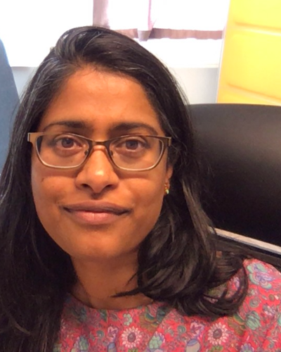
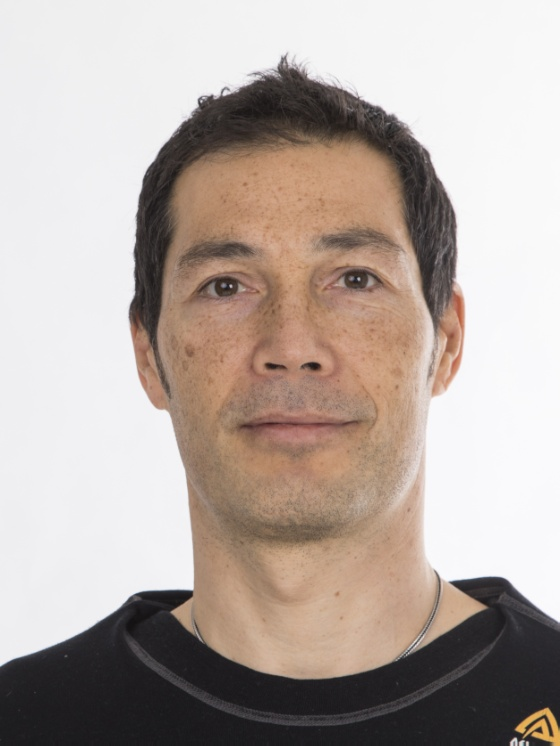
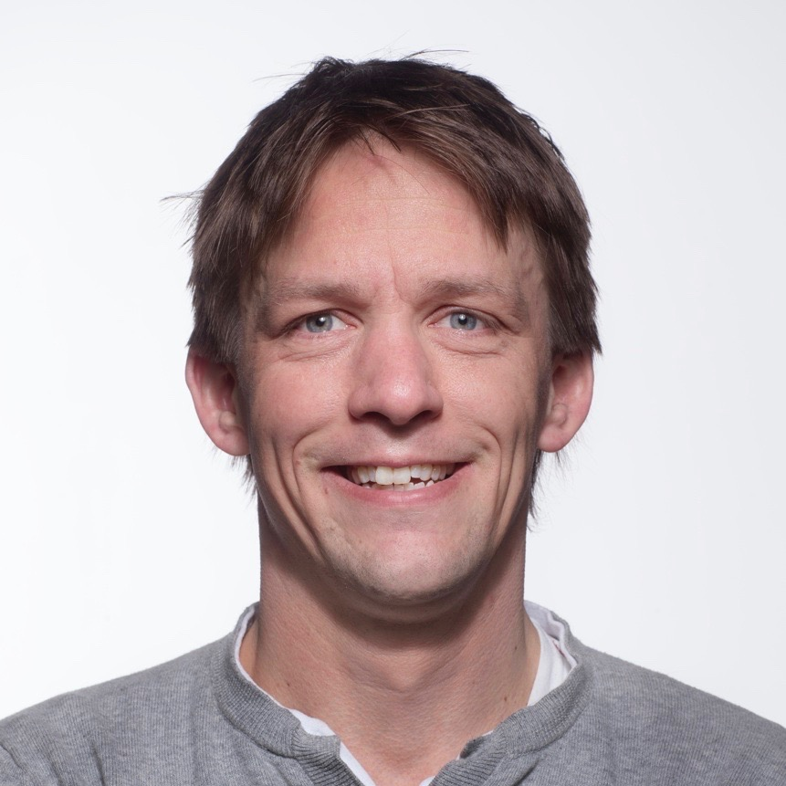
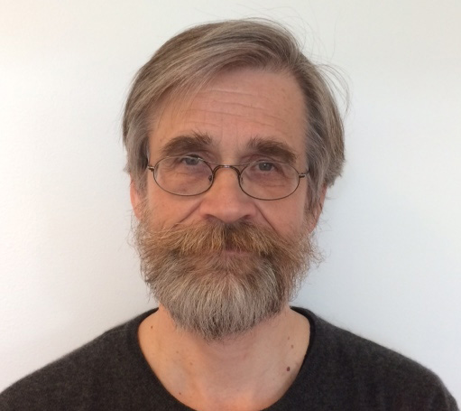
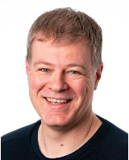
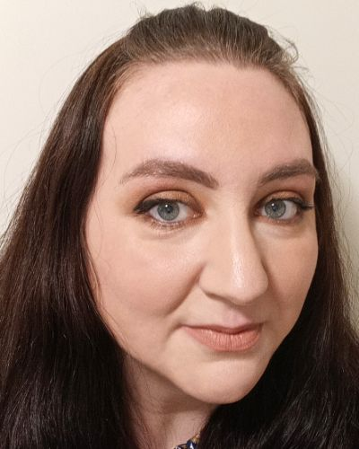
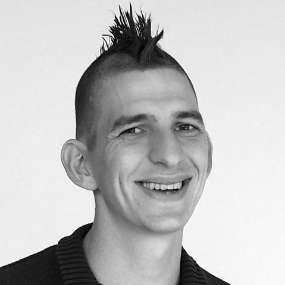
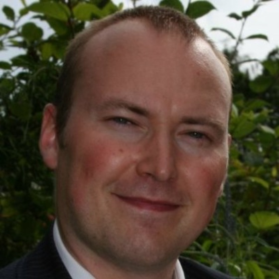

import '@/styles/home.css';

 
# **Head: Node leaders**

||||||
:-:|:-:|:-:|:-:|:-:|
  |  |  |  |  |

**From left to right:**

Sushma Grellscheid (**UiB node and Co-Head of Node ELIXIR Norway**), Erik Hjerde (**UiT node**), Pål Sætrom (**NTNU node**), Simen Rød Sandve (**NMBU node**), Eivind Hovig (**UiO node**)

 
# **Coordinators:**

||||||
:-:|:-:|:-:|:-:|:-:|
  |  |  |  |  |

**From left to right:**

Kjell Petersen (**Technical coordinator**), Erin Calhoun (**Training coordinator**), Korbinian Bösl (**Data Management coordinator**), Espen Åberg (**Service coordinator**), Ingeborg Winge (**Node coordinator**)

 
# Steering board
    - Inge Jonassen (chair), Head, Department of Informatics, University of Bergen
    - Peik Haugen, Head, Department of Chemistry, University of Tromsø
    - Roger Simm, Head, Department of biosciences, University of Oslo
    - Magnus Steigedal, Head, Department of Clinical and Molecular Medicine, NTNU
    - Gro Steine, Head, Department of Animal and Aquacultural Sciences, NMBU
# Scientific advisory committee
##
    * Jaap Heringa, Head of Node ELIXIR Netherlands, VU Amsterdam
    * Jacques van Helden, Co-Head of node ELIXIR France, University of Marseille, FR
    * Anna Kreshuk, group leader at EMBL Heidelberg, Germany, DE
    * Fatima Al-Shahrour, head of the Bioinformatics Unit at Spanish National Cancer Research Centre (CNIO), ES
##
 

# Stakeholder panel
  - Trygve Brautaset, Director, Centre for Digital Life Norway, NTNU
  - Robert Lyle, Senior scientist, The Norwegian Sequencing Centre, Oslo University Hospital
  - Martina Visnovska, Bioinformatics core facility, Oslo University Hospital
  - Rolf Brudvik Edvardsen, Senior scientist, Institute for Marine Research
  - Eli Grindflek, Chief of R&D, Norsvin 
